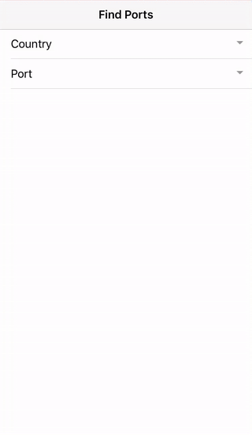

[npm-url]: https://npmjs.org/package/ionic-selectable
[npm-image]: https://img.shields.io/npm/v/ionic-selectable.svg
[dm-image]: https://img.shields.io/npm/dm/ionic-selectable.svg
[dt-image]: https://img.shields.io/npm/dt/ionic-selectable.svg

# Ionic Selectable
[![npm][npm-image]][npm-url]
[![npm][dt-image]][npm-url]
[![npm][dm-image]][npm-url]

[Demo](https://stackblitz.com/edit/ionic-selectable-basic?file=pages/home/home.html) | [Features](#features) | [Getting started](#getting-started) | [FAQ](../../wiki#faq) | [Docs](../../wiki) | [Ask on LinkendIn](https://www.linkedin.com/in/evgeniikoriakin/) | [Support development](https://gumroad.com/products/nkUr)

An Ionic component similar to [Ionic Select](https://ionicframework.com/docs/api/components/select/Select/), that allows to search items, including async search, infinite scrolling and more.



# Contents
* [Demo](https://stackblitz.com/edit/ionic-selectable-basic?file=pages/home/home.html)
* [Features](#features)
* [Getting started](#getting-started)
* [Supported Ionic versions](#supported-ionic-versions)
* [FAQ](../../wiki#faq)
* [Docs](../../wiki)
* [Theming](../../wiki#theming)

## Supported Ionic versions

*	Ionic 3 (3.6.0 - 3.9.2)
* Ionic 4 (>=4.0.0-beta.19)

## Features
* [Single selection](https://stackblitz.com/edit/ionic-selectable-basic?file=pages/home/home.html)
* [Multiple selection](../../wiki#ismultiple)
* [Search items](https://stackblitz.com/edit/ionic-selectable-basic?file=pages/home/home.html)
* [Search items asynchronously](https://stackblitz.com/edit/ionic-selectable-on-search?file=pages/home/home.html)
* [Search by several item fields](https://stackblitz.com/edit/ionic-selectable-on-search?file=pages/home/home.html)
* [Forms](https://stackblitz.com/edit/ionic-selectable-form-control?file=pages/home/home.html)
* [InfiniteScroll](https://stackblitz.com/edit/ionic-selectable-infinite-scroll?file=pages/home/home.html)
* [VirtualScroll](https://stackblitz.com/edit/ionic-selectable-virtual-scroll?file=pages/home/home.html)
* [Templates](../../wiki#templates)
* [Grouping items](../..//wiki#grouping)
* [Editing, adding and deleting items](../../wiki#editing)
* [Disabling items](../../wiki#disableditems)

## Getting started

1. Install it.  
```
// Ionic 3
npm install ionic-selectable@3.4.0 --save

// Ionic 4
npm install ionic-selectable@4.4.0 --save
```

2. Import it.  
First, import `IonicSelectableModule` to your `app.module.ts` that is normally located in `src\app\app.module.ts`.

```
import { IonicSelectableModule } from 'ionic-selectable';

@NgModule({
  imports: [
    IonicSelectableModule
  ]
})
export class AppModule { }

```

**Note:** Additionally, if you use Ionic 3+ you might be as well using lazy loaded pages. Check if your pages have a module file, for example, `home.module.ts`, and if they do then import `IonicSelectableModule` to each page module too.

```
import { IonicSelectableModule } from 'ionic-selectable';
import { HomePage } from './home';

@NgModule({
  declarations: [
    HomePage
  ],
  imports: [
    IonicPageModule.forChild(HomePage),
    IonicSelectableModule
  ]
})
export class HomePageModule { }

```

3. Add it to template.
```
<ion-item>
  <ion-label>Port</ion-label>
  <ionic-selectable
    item-content // Required for Ionic 3 only.
    [(ngModel)]="port"
    [items]="ports"
    itemValueField="id"
    itemTextField="name"
    [canSearch]="true"
    (onChange)="portChange($event)">
  </ionic-selectable>
</ion-item>
```

4. Configure it.
```
import { IonicSelectableComponent } from 'ionic-selectable';

class Port {
  public id: number;
  public name: string;
}

@Component({ ... })
export class HomePage {
  ports: Port[];
  port: Port;

  constructor() {
    this.ports = [
      { id: 1, name: 'Tokai' },
      { id: 2, name: 'Vladivostok' },
      { id: 3, name: 'Navlakhi' }
    ];
  }

  portChange(event: {
    component: IonicSelectableComponent,
    value: any 
  }) {
    console.log('port:', event.value);
  }
}
```

5. Enjoy it 😉
6. Check out [live demos](https://stackblitz.com/@eakoriakin) to see what it is capable of.  
Also, explore the [docs](../../wiki) and [FAQ](../../wiki#faq) to learn more about its features.
7. Have a question? Ask me on [LinkendIn](https://www.linkedin.com/in/evgeniikoriakin/)!

## Development
* `ionic serve` ([v3](../../tree/v3)) or `ng serve` ([v4](../../tree/master)) runs dev app containing test cases/demos.
* `gulp` creates npm package.
* `npm publish dist` publishes npm package.

## Share it
If you find this component useful, please star the [repo](https://github.com/eakoriakin/ionic-selectable) to let others know that it's reliable. Also, share it with friends and colleagues who might find it useful as well. Thank you 😄
