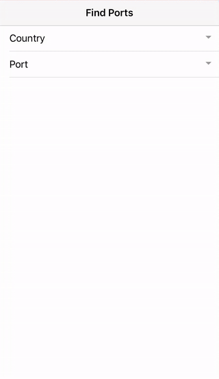

[npm-url]: https://npmjs.org/package/ionic-selectable
[npm-image]: https://img.shields.io/npm/v/ionic-selectable.svg
[dm-image]: https://img.shields.io/npm/dm/ionic-selectable.svg
[dt-image]: https://img.shields.io/npm/dt/ionic-selectable.svg

# Ionic Selectable

[![npm][npm-image]][npm-url]
[![npm][dt-image]][npm-url]
[![npm][dm-image]][npm-url]

[Features](#features) | [Getting started](#getting-started) | [Virtual scroll](#virtual-scroll) | [FAQ](../../wiki#faq) | [Docs](../../wiki)

An Ionic component similar to [Ionic Select](https://ionicframework.com/docs/api/select), that allows to search items, including async search, infinite scrolling, virtual scrolling and more.



> **Which package am I looking at?** This is the **Angular** component. There
> is also a separate [Stencil-based line](https://github.com/ionic-selectable/ionic-selectable/tree/v6)
> that ships web components for vanilla JS and other frameworks. The
> instructions below are for the Angular package.

# Contents

- [Features](#features)
- [Compatibility](#compatibility)
- [Getting started](#getting-started)
- [Virtual scroll](#virtual-scroll)
- [Development](#development)
- [FAQ](../../wiki#faq)
- [Docs](../../wiki)
- [Theming](../../wiki#theming)

## Compatibility

| ionic-selectable | Ionic | Angular |
| ---------------- | ----- | ------- |
| 7.x              | 8     | 20 – 22 |
| 6.x              | 7     | 16      |
| 4.x              | 4     | —       |
| 3.x              | 3     | —       |

**7.x is a standalone build.** The component, the modal and all template
directives are standalone, and Ionic is consumed through
`@ionic/angular/standalone`. It works both in apps bootstrapped with
`provideIonicAngular()` and in apps still using `IonicModule.forRoot()`.

The package is published in Angular's *partial* compilation mode, so a build
made with Angular 21 links cleanly into Angular 20, 21 and 22 applications.

## Features

- Single selection
- [Multiple selection](../../wiki#ismultiple)
- Search items
- [Search items asynchronously](../../wiki#onsearch)
- Search by several item fields
- [Forms](../../wiki#form-control)
- [InfiniteScroll](../../wiki#hasinfinitescroll)
- [Virtual scroll, with group headers](#virtual-scroll)
- [Templates](../../wiki#templates)
- [Grouping items](../../wiki#grouping)
- [Editing, adding and deleting items](../../wiki#editing)
- [Disabling items](../../wiki#disableditems)

## Getting started

### 1. Install it

```bash
npm install ionic-selectable --save
```

`@angular/cdk` is a peer dependency — it powers the virtual scroll viewport —
so install it too if your app doesn't have it already:

```bash
npm install @angular/cdk --save
```

### 2. Import it

Because the component is standalone, import it directly into whichever
component uses it:

```ts
import { Component } from '@angular/core';
import { FormsModule } from '@angular/forms';
import { IonItem, IonLabel } from '@ionic/angular/standalone';
import { IonicSelectableComponent } from 'ionic-selectable';

@Component({
  selector: 'app-home',
  templateUrl: './home.page.html',
  imports: [FormsModule, IonItem, IonLabel, IonicSelectableComponent]
})
export class HomePage { }
```

If you use the template directives (`ionicSelectableItemTemplate`,
`ionicSelectableValueTemplate`, …), import them alongside the component, or
import `IonicSelectableModule`, which re-exports the component and every
directive at once:

```ts
import { IonicSelectableModule } from 'ionic-selectable';

@Component({
  // ...
  imports: [IonicSelectableModule]
})
export class HomePage { }
```

`IonicSelectableModule` is also still a valid `NgModule` import, so existing
module-based apps keep working unchanged:

```ts
@NgModule({
  imports: [IonicSelectableModule]
})
export class AppModule { }
```
**For Angular 16 standalone component**

```
import { IonicSelectableComponent } from 'ionic-selectable';

@Component({
    ...,
    standalone: true,
    imports: [IonicSelectableComponent]
})

```

### 3. Add it to the template

```html
<ion-item>
  <ion-label>Port</ion-label>
  <ionic-selectable
    [(ngModel)]="port"
    [items]="ports"
    itemValueField="id"
    itemTextField="name"
    [canSearch]="true"
    (onChange)="portChange($event)">
  </ionic-selectable>
</ion-item>
```

### 4. Configure it

```ts
import { Component } from '@angular/core';
import { IonicSelectableComponent } from 'ionic-selectable';

interface Port {
  id: number;
  name: string;
}

@Component({ /* ... */ })
export class HomePage {
  ports: Port[] = [
    { id: 1, name: 'Tokai' },
    { id: 2, name: 'Vladivostok' },
    { id: 3, name: 'Navlakhi' }
  ];
  port: Port | undefined;

  portChange(event: { component: IonicSelectableComponent; value: any }) {
    console.log('port:', event.value);
  }
}
```

### 5. Enjoy it 😉

Explore the [docs](../../wiki) and [FAQ](../../wiki#faq) to learn more about
its features, and run the demo app in this repo to see every option in action.

## Virtual scroll

Set `hasVirtualScroll` when the list is long enough that rendering every item
hurts. The modal then renders the list through an Angular CDK
[virtual scroll viewport](https://material.angular.io/cdk/scrolling/overview),
keeping only the visible rows in the DOM.

```html
<ionic-selectable
  [(ngModel)]="port"
  [items]="ports"
  itemValueField="id"
  itemTextField="name"
  [hasVirtualScroll]="true"
  [canSearch]="true">
</ionic-selectable>
```

### Grouping

Groups and virtual scroll can be used together. Groups are flattened into a
single stream of header and item rows, so `groupValueField` / `groupTextField`
work exactly as they do in a regular list:

```html
<ionic-selectable
  [(ngModel)]="port"
  [items]="ports"
  itemValueField="id"
  itemTextField="name"
  groupValueField="country.id"
  groupTextField="country.name"
  [hasVirtualScroll]="true">
</ionic-selectable>
```

When the items aren't grouped with `groupValueField`, headers can still be
inserted with `virtualScrollHeaderFn`. It receives each item and returns the
header text to render before it, or `undefined` for no header:

```html
<ionic-selectable
  [hasVirtualScroll]="true"
  [virtualScrollHeaderFn]="getGroupText">
</ionic-selectable>
```

```ts
getGroupText(port: Port, index: number, ports: Port[]) {
  if (index === 0 || port.country.id !== ports[index - 1].country.id) {
    return port.country.name;
  }

  return undefined;
}
```

### Row height

Rows are rendered at a fixed height, which defaults to `40px`. Both items and
group headers are pinned to it. Change it with `virtualScrollApproxItemHeight`,
which accepts a number of pixels or a `px` string:

```html
<ionic-selectable [hasVirtualScroll]="true" [virtualScrollApproxItemHeight]="56">
</ionic-selectable>
```

The value is also exposed to CSS as `--ionic-selectable-virtual-item-height` on
the viewport, so custom item templates can lay themselves out against it.

### Notes

- Virtual scroll and `hasInfiniteScroll` are mutually exclusive. With virtual
  scroll enabled, infinite scroll is not rendered and
  `enableInfiniteScroll()` / `disableInfiniteScroll()` / `endInfiniteScroll()`
  are no-ops.
- `scrollToTop()` and `scrollToBottom()` operate on the viewport.
- The viewport is the scrolling element, so `ion-content` scrolling is turned
  off while virtual scroll is on.
- Searching resets the viewport back to the first row.

## Development

The repo contains both the library (`src/app/components/ionic-selectable`) and
a demo app covering every feature (`src/app/pages`).

```bash
npm install        # install dependencies
npm start          # serve the demo app
npm run build      # build the demo app
npm test           # run unit tests
npm run lint       # lint
npm run build.ng   # build the publishable library into dist/
```

For contribution guidelines please refer to
[Contribution](../../wiki/Contribution).

## Share it

If you find this component useful, please star the [repo](https://github.com/ionic-selectable/ionic-selectable) to let others know that it's reliable. Also, share it with friends and colleagues who might find it useful as well. Thank you 😄
