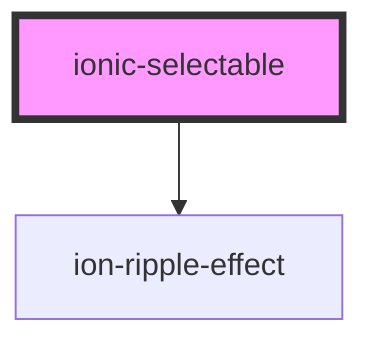

# ionic-selectable

<!-- Auto Generated Below -->

## Properties

| Property                          | Attribute                             | Description                                                                                                                                                                                                                                                                                                                                                                                                    | Type                                                                                  | Default                                                   |
| --------------------------------- | ------------------------------------- | -------------------------------------------------------------------------------------------------------------------------------------------------------------------------------------------------------------------------------------------------------------------------------------------------------------------------------------------------------------------------------------------------------------- | ------------------------------------------------------------------------------------- | --------------------------------------------------------- |
| `addButtonText`                   | `add-button-text`                     | Add button text. See more on [GitHub](https://github.com/eakoriakin/ionic-selectable/wiki/Documentation#addbuttontext).                                                                                                                                                                                                                                                                                        | `string`                                                                              | `'Add'`                                                   |
| `canAddItem`                      | `can-add-item`                        | Determines whether to allow adding items. See more on [GitHub](https://github.com/eakoriakin/ionic-selectable/wiki/Documentation#canadditem).                                                                                                                                                                                                                                                                  | `boolean`                                                                             | `false`                                                   |
| `canClear`                        | `can-clear`                           | Determines whether to show Clear button. See more on [GitHub](https://github.com/eakoriakin/ionic-selectable/wiki/Documentation#canclear).                                                                                                                                                                                                                                                                     | `boolean`                                                                             | `false`                                                   |
| `canSearch`                       | `can-search`                          | Determines whether to show [Searchbar](https://ionicframework.com/docs/api/searchbar). See more on [GitHub](https://github.com/eakoriakin/ionic-selectable/wiki/Documentation#cansearch).                                                                                                                                                                                                                      | `boolean`                                                                             | `false`                                                   |
| `clearButtonText`                 | `clear-button-text`                   | Clear button text. See more on [GitHub](https://github.com/eakoriakin/ionic-selectable/wiki/Documentation#clearbuttontext).                                                                                                                                                                                                                                                                                    | `string`                                                                              | `'Clear'`                                                 |
| `closeButtonSlot`                 | `close-button-slot`                   | Close button slot. [Ionic slots](https://ionicframework.com/docs/api/buttons) are supported. See more on [GitHub](https://github.com/eakoriakin/ionic-selectable/wiki/Documentation#closebuttonslot).                                                                                                                                                                                                          | `string`                                                                              | `'start'`                                                 |
| `closeButtonText`                 | `close-button-text`                   | Close button text. The field is only applicable to **iOS** platform, on **Android** only Cross icon is displayed. See more on [GitHub](https://github.com/eakoriakin/ionic-selectable/wiki/Documentation#closebuttontext).                                                                                                                                                                                     | `string`                                                                              | `'Cancel'`                                                |
| `confirmButtonText`               | `confirm-button-text`                 | Confirm button text. See more on [GitHub](https://github.com/eakoriakin/ionic-selectable/wiki/Documentation#confirmbuttontext).                                                                                                                                                                                                                                                                                | `string`                                                                              | `'OK'`                                                    |
| `disabledItems`                   | --                                    | A list of items to disable. See more on [GitHub](https://github.com/eakoriakin/ionic-selectable/wiki/Documentation#disableditems).                                                                                                                                                                                                                                                                             | `any[]`                                                                               | `[]`                                                      |
| `groupColor`                      | `group-color`                         | Group color. [Ionic colors](https://ionicframework.com/docs/theming/advanced#colors) are supported. See more on [GitHub](https://github.com/eakoriakin/ionic-selectable/wiki/Documentation#groupcolor).                                                                                                                                                                                                        | `string`                                                                              | `null`                                                    |
| `groupTextField`                  | `group-text-field`                    | Group property to display, e.g. `'country.name'`. **Note**: `items` should be an object array. See more on [GitHub](https://github.com/eakoriakin/ionic-selectable/wiki/Documentation#grouptextfield).                                                                                                                                                                                                         | `string`                                                                              | `null`                                                    |
| `groupValueField`                 | `group-value-field`                   | Group property to use as a unique identifier to group items, e.g. `'country.id'`. **Note**: `items` should be an object array. See more on [GitHub](https://github.com/eakoriakin/ionic-selectable/wiki/Documentation#groupvaluefield).                                                                                                                                                                        | `string`                                                                              | `null`                                                    |
| `hasConfirmButton`                | `has-confirm-button`                  | Determines whether Confirm button is visible for single selection. By default Confirm button is visible only for multiple selection. **Note**: It is always true for multiple selection and cannot be changed. See more on [GitHub](https://github.com/eakoriakin/ionic-selectable/wiki/Documentation#hasconfirmbutton).                                                                                       | `boolean`                                                                             | `false`                                                   |
| `hasInfiniteScroll`               | `has-infinite-scroll`                 | Determines whether Ionic [InfiniteScroll](https://ionicframework.com/docs/api/infinite-scroll) is enabled. See more on [GitHub](https://github.com/eakoriakin/ionic-selectable/wiki/Documentation#hasinfinitescroll).                                                                                                                                                                                          | `boolean`                                                                             | `false`                                                   |
| `hasSearchText`                   | `has-search-text`                     | Determines whether user has typed anything in [Searchbar](https://ionicframework.com/docs/api/searchbar). See more on [GitHub](https://github.com/eakoriakin/ionic-selectable/wiki/Documentation#hassearchtext).                                                                                                                                                                                               | `boolean`                                                                             | `undefined`                                               |
| `hasVirtualScroll`                | `has-virtual-scroll`                  | Determines whether Ionic [VirtualScroll](https://ionicframework.com/docs/api/virtual-scroll) is enabled. See more on [GitHub](https://github.com/eakoriakin/ionic-selectable/wiki/Documentation#hasvirtualscroll).                                                                                                                                                                                             | `boolean`                                                                             | `false`                                                   |
| `headerColor`                     | `header-color`                        | Header color. [Ionic colors](https://ionicframework.com/docs/theming/advanced#colors) are supported. See more on [GitHub](https://github.com/eakoriakin/ionic-selectable/wiki/Documentation#headercolor).                                                                                                                                                                                                      | `string`                                                                              | `null`                                                    |
| `infiniteScrollThreshold`         | `infinite-scroll-threshold`           | The threshold distance from the bottom of the content to call the infinite output event when scrolled. Use the value 100px when the scroll is within 100 pixels from the bottom of the page. See more on [GitHub](https://github.com/eakoriakin/ionic-selectable/wiki/Documentation#infinite-scroll).                                                                                                          | `string`                                                                              | `'100px'`                                                 |
| `isConfirmButtonEnabled`          | `is-confirm-button-enabled`           | Determines whether Confirm button is enabled. See more on [GitHub](https://github.com/eakoriakin/ionic-selectable/wiki/Documentation#isconfirmbuttonenabled).                                                                                                                                                                                                                                                  | `boolean`                                                                             | `true`                                                    |
| `isDisabled`                      | `is-disabled`                         | Determines whether the component is disabled. See more on [GitHub](https://github.com/eakoriakin/ionic-selectable/wiki/Documentation#isdisabled).                                                                                                                                                                                                                                                              | `boolean`                                                                             | `false`                                                   |
| `isMultiple`                      | `is-multiple`                         | Determines whether multiple items can be selected. See more on [GitHub](https://github.com/eakoriakin/ionic-selectable/wiki/Documentation#ismultiple).                                                                                                                                                                                                                                                         | `boolean`                                                                             | `false`                                                   |
| `isOpened`                        | `is-opened`                           | Determines whether Modal is opened. See more on [GitHub](https://github.com/eakoriakin/ionic-selectable/wiki/Documentation#isopened).                                                                                                                                                                                                                                                                          | `boolean`                                                                             | `false`                                                   |
| `itemIconSlot`                    | `item-icon-slot`                      | Item icon slot. [Ionic slots](https://ionicframework.com/docs/api/item) are supported. See more on [GitHub](https://github.com/eakoriakin/ionic-selectable/wiki/Documentation#itemiconslot).                                                                                                                                                                                                                   | `string`                                                                              | `'start'`                                                 |
| `itemTextField`                   | `item-text-field`                     | Item property to display, e.g, `'name'`. **Note**: `items` should be an object array. See more on [GitHub](https://github.com/eakoriakin/ionic-selectable/wiki/Documentation#itemtextfield).                                                                                                                                                                                                                   | `string`                                                                              | `null`                                                    |
| `itemValueField`                  | `item-value-field`                    | Item property to use as a unique identifier, e.g, `'id'`. **Note**: `items` should be an object array. See more on [GitHub](https://github.com/eakoriakin/ionic-selectable/wiki/Documentation#itemvaluefield).                                                                                                                                                                                                 | `string`                                                                              | `null`                                                    |
| `items`                           | --                                    | A list of items. See more on [GitHub](https://github.com/eakoriakin/ionic-selectable/wiki/Documentation#items).                                                                                                                                                                                                                                                                                                | `any[]`                                                                               | `[]`                                                      |
| `modalCssClass`                   | `modal-css-class`                     | Modal CSS class. See more on [GitHub](https://github.com/eakoriakin/ionic-selectable/wiki/Documentation#modalcssclass).                                                                                                                                                                                                                                                                                        | `string`                                                                              | `null`                                                    |
| `modalEnterAnimation`             | --                                    | Modal enter animation. See more on [GitHub](https://github.com/eakoriakin/ionic-selectable/wiki/Documentation#modalenteranimation).                                                                                                                                                                                                                                                                            | `(baseEl: any, opts?: any) => Animation`                                              | `null`                                                    |
| `modalLeaveAnimation`             | --                                    | Modal leave animation. See more on [GitHub](https://github.com/eakoriakin/ionic-selectable/wiki/Documentation#modalleaveanimation).                                                                                                                                                                                                                                                                            | `(baseEl: any, opts?: any) => Animation`                                              | `null`                                                    |
| `mode`                            | `mode`                                | The mode determines which platform styles to use.                                                                                                                                                                                                                                                                                                                                                              | `"ios" \| "md"`                                                                       | `undefined`                                               |
| `name`                            | `name`                                | The name of the control, which is submitted with the form data. See more on [GitHub](https://github.com/eakoriakin/ionic-selectable/wiki/Documentation#name).                                                                                                                                                                                                                                                  | `string`                                                                              | `this.id`                                                 |
| `placeholder`                     | `placeholder`                         | A placeholder. See more on [GitHub](https://github.com/eakoriakin/ionic-selectable/wiki/Documentation#placeholder).                                                                                                                                                                                                                                                                                            | `string`                                                                              | `undefined`                                               |
| `searchCancelButtonIcon`          | `search-cancel-button-icon`           | Set the cancel button icon of the [Searchbar](https://ionicframework.com/docs/api/searchbar). Only applies to md mode. Defaults to "arrow-back-sharp". See more on [GitHub](https://github.com/eakoriakin/ionic-selectable/wiki/Documentation#hassearchtext).                                                                                                                                                  | `string`                                                                              | `'arrow-back-sharp'`                                      |
| `searchCancelButtonText`          | `search-cancel-button-text`           | Set the the cancel button text of the [Searchbar](https://ionicframework.com/docs/api/searchbar). Only applies to ios mode. See more on [GitHub](https://github.com/eakoriakin/ionic-selectable/wiki/Documentation#hassearchtext).                                                                                                                                                                             | `string`                                                                              | `'Cancel'`                                                |
| `searchClearIcon`                 | `search-clear-icon`                   | Set the clear icon of the [Searchbar](https://ionicframework.com/docs/api/searchbar). Defaults to "close-circle" for ios and "close-sharp" for md. See more on [GitHub](https://github.com/eakoriakin/ionic-selectable/wiki/Documentation#hassearchtext).                                                                                                                                                      | `string`                                                                              | `getMode() === 'ios' ? 'close-circle' : 'close-sharp'`    |
| `searchDebounce`                  | `search-debounce`                     | How long, in milliseconds, to wait to filter items or to trigger `onSearch` event after each keystroke. See more on [GitHub](https://github.com/eakoriakin/ionic-selectable/wiki/Documentation#searchdebounce).                                                                                                                                                                                                | `number`                                                                              | `250`                                                     |
| `searchFailText`                  | `search-fail-text`                    | Text to display when no items have been found during search. See more on [GitHub](https://github.com/eakoriakin/ionic-selectable/wiki/Documentation#searchfailtext).                                                                                                                                                                                                                                           | `string`                                                                              | `'No items found.'`                                       |
| `searchIcon`                      | `search-icon`                         | The icon to use as the search icon in the [Searchbar](https://ionicframework.com/docs/api/searchbar). Defaults to "search-outline" in ios mode and "search-sharp" in md mode. See more on [GitHub](https://github.com/eakoriakin/ionic-selectable/wiki/Documentation#hassearchtext).                                                                                                                           | `string`                                                                              | `getMode() === 'ios' ? 'search-outline' : 'search-sharp'` |
| `searchInputmode`                 | `search-inputmode`                    | A hint to the browser for which keyboard to display. Possible values: "none", "text", "tel", "url", "email", "numeric", "decimal", and "search". See more on [GitHub](https://github.com/eakoriakin/ionic-selectable/wiki/Documentation#hassearchtext).                                                                                                                                                        | `"decimal" \| "email" \| "none" \| "numeric" \| "search" \| "tel" \| "text" \| "url"` | `'none'`                                                  |
| `searchPlaceholder`               | `search-placeholder`                  | A placeholder for [Searchbar](https://ionicframework.com/docs/api/searchbar). See more on [GitHub](https://github.com/eakoriakin/ionic-selectable/wiki/Documentation#searchplaceholder).                                                                                                                                                                                                                       | `string`                                                                              | `'Search'`                                                |
| `searchShowCancelButton`          | `search-show-cancel-button`           | Sets the behavior for the cancel button of the [Searchbar](https://ionicframework.com/docs/api/searchbar). Defaults to "never". Setting to "focus" shows the cancel button on focus. Setting to "never" hides the cancel button. Setting to "always" shows the cancel button regardless of focus state. See more on [GitHub](https://github.com/eakoriakin/ionic-selectable/wiki/Documentation#hassearchtext). | `"always" \| "focus" \| "never"`                                                      | `'never'`                                                 |
| `searchText`                      | `search-text`                         | Text in [Searchbar](https://ionicframework.com/docs/api/searchbar). See more on [GitHub](https://github.com/eakoriakin/ionic-selectable/wiki/Documentation#searchtext).                                                                                                                                                                                                                                        | `string`                                                                              | `''`                                                      |
| `selectedText`                    | `selected-text`                       | Determines whether multiple items can be selected. See more on [GitHub](https://github.com/eakoriakin/ionic-selectable/wiki/Documentation#selectedText).                                                                                                                                                                                                                                                       | `string`                                                                              | `undefined`                                               |
| `shouldBackdropClose`             | `should-backdrop-close`               | Determines whether Modal should be closed when backdrop is clicked. See more on [GitHub](https://github.com/eakoriakin/ionic-selectable/wiki/Documentation#shouldbackdropclose).                                                                                                                                                                                                                               | `boolean`                                                                             | `undefined`                                               |
| `shouldDelegateSearchToEvent`     | `should-delegate-search-to-event`     | Determines the search is delegate to event, and not handled internally. See more on [GitHub](https://github.com/eakoriakin/ionic-selectable/wiki/Documentation#cansearch).                                                                                                                                                                                                                                     | `boolean`                                                                             | `false`                                                   |
| `shouldFocusSearchbar`            | `should-focus-searchbar`              | Determines whether Searchbar should receive focus when Modal is opened. See more on [GitHub](https://github.com/eakoriakin/ionic-selectable/wiki/Documentation#shouldfocussearchbar).                                                                                                                                                                                                                          | `boolean`                                                                             | `false`                                                   |
| `shouldStoreItemValue`            | `should-store-item-value`             | Is set to true, the value will be extracted from the itemValueField of the objects. See more on [GitHub](https://github.com/eakoriakin/ionic-selectable/wiki/Documentation#shouldStoreItemValue).                                                                                                                                                                                                              | `boolean`                                                                             | `false`                                                   |
| `titleText`                       | `title-text`                          | Text of [Ionic Label](https://ionicframework.com/docs/api/label). See more on [GitHub](https://github.com/eakoriakin/ionic-selectable/wiki/Documentation#label).                                                                                                                                                                                                                                               | `string`                                                                              | `null`                                                    |
| `value`                           | `value`                               | The value of the component. See more on [GitHub](https://github.com/eakoriakin/ionic-selectable/wiki/Documentation#value).                                                                                                                                                                                                                                                                                     | `any`                                                                                 | `null`                                                    |
| `virtualScrollApproxHeaderHeight` | `virtual-scroll-approx-header-height` | See Ionic VirtualScroll [approxHeaderHeight](https://ionicframework.com/docs/api/virtual-scroll). See more on [GitHub](https://github.com/eakoriakin/ionic-selectable/wiki/Documentation#virtualscrollheaderfn).                                                                                                                                                                                               | `number`                                                                              | `30`                                                      |
| `virtualScrollApproxItemHeight`   | `virtual-scroll-approx-item-height`   | See Ionic VirtualScroll [approxItemHeight](https://ionicframework.com/docs/api/virtual-scroll). See more on [GitHub](https://github.com/eakoriakin/ionic-selectable/wiki/Documentation#virtualscrollheaderfn).                                                                                                                                                                                                 | `number`                                                                              | `45`                                                      |
| `virtualScrollHeaderFn`           | --                                    | See Ionic VirtualScroll [headerFn](https://ionicframework.com/docs/api/virtual-scroll). See more on [GitHub](https://github.com/eakoriakin/ionic-selectable/wiki/Documentation#virtualscrollheaderfn).                                                                                                                                                                                                         | `() => any`                                                                           | `() => null`                                              |

## Events

| Event              | Description                                                                                                                                                                                                                                                                                                                | Type                                                        |
| ------------------ | -------------------------------------------------------------------------------------------------------------------------------------------------------------------------------------------------------------------------------------------------------------------------------------------------------------------------- | ----------------------------------------------------------- |
| `blurred`          | Fires when loses focus. See more on [GitHub](https://github.com/eakoriakin/ionic-selectable/wiki/Documentation#onBlurred).                                                                                                                                                                                                 | `CustomEvent<IonicSelectableBlurredEvent<any[]>>`           |
| `changed`          | Fires when item/s has been selected and Modal closed. if isMultiple is set to true 'value' is an array else is a object See more on [GitHub](https://github.com/eakoriakin/ionic-selectable/wiki/Documentation#onChanged).                                                                                                 | `CustomEvent<IonicSelectableChangedEvent<any[]>>`           |
| `cleared`          | Fires when Clear button has been clicked. See more on [GitHub](https://github.com/eakoriakin/ionic-selectable/wiki/Documentation#onclear).                                                                                                                                                                                 | `CustomEvent<IonicSelectableClearedEvent<any[]>>`           |
| `closed`           | Fires when Modal has been closed. See more on [GitHub](https://github.com/eakoriakin/ionic-selectable/wiki/Documentation#onclose).                                                                                                                                                                                         | `CustomEvent<IonicSelectableClosedEvent<any[]>>`            |
| `focused`          | Fires when has focus See more on [GitHub](https://github.com/eakoriakin/ionic-selectable/wiki/Documentation#onFocused).                                                                                                                                                                                                    | `CustomEvent<IonicSelectableFocusedEvent<any[]>>`           |
| `infiniteScrolled` | Fires when the user has scrolled to the end of the list. **Note**: `hasInfiniteScroll` has to be enabled. See more on [GitHub](https://github.com/eakoriakin/ionic-selectable/wiki/Documentation#oninfinitescroll).                                                                                                        | `CustomEvent<IonicSelectableInfiniteScrolledEvent<string>>` |
| `itemAdding`       | Fires when Add item button has been clicked. When the button has been clicked `ionicSelectableAddItemTemplate` will be shown. Use the template to create a form to add item. **Note**: `canAddItem` has to be enabled. See more on [GitHub](https://github.com/eakoriakin/ionic-selectable/wiki/Documentation#itemAdding). | `CustomEvent<IonicSelectableItemAddingEvent<any[]>>`        |
| `itemsChanged`     | Fires when items has changed. if isMultiple is set to true 'value' is an array else is a object See more on [GitHub](https://github.com/eakoriakin/ionic-selectable/wiki/Documentation#onChanged).                                                                                                                         | `CustomEvent<IonicSelectableItemsChangedEvent<any[]>>`      |
| `opened`           | Fires when Modal has been opened. See more on [GitHub](https://github.com/eakoriakin/ionic-selectable/wiki/Documentation#onopen).                                                                                                                                                                                          | `CustomEvent<IonicSelectableOpenedEvent<any[]>>`            |
| `searchFailed`     | Fires when no items have been found. See more on [GitHub](https://github.com/eakoriakin/ionic-selectable/wiki/Documentation#onsearchfail).                                                                                                                                                                                 | `CustomEvent<IonicSelectableSearchFailedEvent<string>>`     |
| `searching`        | Fires when the user is typing in Searchbar. **Note**: `canSearch` and `shouldDelegateSearchToEvent` has to be enabled. See more on [GitHub](https://github.com/eakoriakin/ionic-selectable/wiki/Documentation#onsearch).                                                                                                   | `CustomEvent<IonicSelectableSearchingEvent<string>>`        |
| `searchSuccessed`  | Fires when some items have been found. See more on [GitHub](https://github.com/eakoriakin/ionic-selectable/wiki/Documentation#onsearchsuccess).                                                                                                                                                                            | `CustomEvent<IonicSelectableSearchSuccessedEvent<string>>`  |
| `selected`         | Fires when an item has been selected or unselected. See more on [GitHub](https://github.com/eakoriakin/ionic-selectable/wiki/Documentation#onselect).                                                                                                                                                                      | `CustomEvent<IonicSelectableSelectedEvent<any>>`            |

## Methods

### `addItem(item: any) => Promise<any>`

Adds item.
**Note**: If you want an item to be added to the original array as well use two-way data binding syntax on `[(items)]` field.
See more on [GitHub](https://github.com/eakoriakin/ionic-selectable/wiki/Documentation#additem).

#### Returns

Type: `Promise<any>`

### `clear() => Promise<void>`

Clears value.
See more on [GitHub](https://github.com/eakoriakin/ionic-selectable/wiki/Documentation#clear).

#### Returns

Type: `Promise<void>`

### `close() => Promise<void>`

Closes Modal.
See more on [GitHub](https://github.com/eakoriakin/ionic-selectable/wiki/Documentation#close).

#### Returns

Type: `Promise<void>`

### `confirm() => Promise<void>`

Confirms selected items by updating value.
See more on [GitHub](https://github.com/eakoriakin/ionic-selectable/wiki/Documentation#confirm).

#### Returns

Type: `Promise<void>`

### `deleteItem(item: any) => Promise<any>`

Deletes item.
**Note**: If you want an item to be deleted from the original array as well use two-way data binding syntax on `[(items)]` field.
See more on [GitHub](https://github.com/eakoriakin/ionic-selectable/wiki/Documentation#deleteitem).

#### Returns

Type: `Promise<any>`

### `disableInfiniteScroll() => Promise<void>`

Disables infinite scroll.
See more on [GitHub](https://github.com/eakoriakin/ionic-selectable/wiki/Documentation#disableinfinitescroll).

#### Returns

Type: `Promise<void>`

### `enableInfiniteScroll() => Promise<void>`

Enables infinite scroll.
See more on [GitHub](https://github.com/eakoriakin/ionic-selectable/wiki/Documentation#enableinfinitescroll).

#### Returns

Type: `Promise<void>`

### `endInfiniteScroll() => Promise<void>`

Ends infinite scroll.
See more on [GitHub](https://github.com/eakoriakin/ionic-selectable/wiki/Documentation#endinfinitescroll).

#### Returns

Type: `Promise<void>`

### `endSearch() => Promise<void>`

Ends search process by hiding Loading spinner and refreshing items.
Use it together with `onSearch` event to indicate search end.
See more on [GitHub](https://github.com/eakoriakin/ionic-selectable/wiki/Documentation#endsearch).

#### Returns

Type: `Promise<void>`

### `getItemsToConfirm() => Promise<any[]>`

Return a list of items that are selected and awaiting confirmation by user, when he has clicked Confirm button.
After the user has clicked Confirm button items to confirm are cleared.
See more on [GitHub](https://github.com/eakoriakin/ionic-selectable/wiki/Documentation#itemstoconfirm).

#### Returns

Type: `Promise<any[]>`

### `hasValue() => Promise<boolean>`

Determines whether any item has been selected.
See more on [GitHub](https://github.com/eakoriakin/ionic-selectable/wiki/Documentation#hasvalue).

#### Returns

Type: `Promise<boolean>`

### `hideLoading() => Promise<void>`

Hides Loading spinner.
See more on [GitHub](https://github.com/eakoriakin/ionic-selectable/wiki/Documentation#hideloading).

#### Returns

Type: `Promise<void>`

### `open() => Promise<void>`

Opens Modal.
See more on [GitHub](https://github.com/eakoriakin/ionic-selectable/wiki/Documentation#open).

#### Returns

Type: `Promise<void>`

### `scrollToBottom() => Promise<any>`

Scrolls to the bottom of Modal content.
See more on [GitHub](https://github.com/eakoriakin/ionic-selectable/wiki/Documentation#scrolltobottom).

#### Returns

Type: `Promise<any>`

### `scrollToTop() => Promise<any>`

Scrolls to the top of Modal content.
See more on [GitHub](https://github.com/eakoriakin/ionic-selectable/wiki/Documentation#scrolltotop).

#### Returns

Type: `Promise<any>`

### `showLoading() => Promise<void>`

Shows Loading spinner.
See more on [GitHub](https://github.com/eakoriakin/ionic-selectable/wiki/Documentation#showloading).

#### Returns

Type: `Promise<void>`

### `startSearch() => Promise<void>`

Starts search process by showing Loading spinner.
Use it together with `onSearch` event to indicate search start.
See more on [GitHub](https://github.com/eakoriakin/ionic-selectable/wiki/Documentation#startsearch).

#### Returns

Type: `Promise<void>`

### `toggleItems(isSelect: boolean, items?: any[]) => Promise<void>`

Selects or deselects all or specific items.
See more on [GitHub](https://github.com/eakoriakin/ionic-selectable/wiki/Documentation#toggleitems).

#### Returns

Type: `Promise<void>`

## Shadow Parts

| Part            | Description                                              |
| --------------- | -------------------------------------------------------- |
| `"icon"`        | The select icon container.                               |
| `"icon-inner"`  | The select icon.                                         |
| `"placeholder"` | The text displayed in the select when there is no value. |
| `"text"`        | The displayed value of the select.                       |

## CSS Custom Properties

| Name                    | Description                                                                                 |
| ----------------------- | ------------------------------------------------------------------------------------------- |
| `--padding-bottom`      | Bottom padding                                                                              |
| `--padding-end`         | Right padding if direction is left-to-right, and left padding if direction is right-to-left |
| `--padding-start`       | Left padding if direction is left-to-right, and right padding if direction is right-to-left |
| `--padding-top`         | Top padding                                                                                 |
| `--placeholder-color`   | Placeholder color                                                                           |
| `--placeholder-opacity` | Placeholder opacity                                                                         |

## Dependencies

### Depends on

- ion-ripple-effect

### Graph

----------------------------------------------

*Built with [StencilJS](https://stenciljs.com/)*
