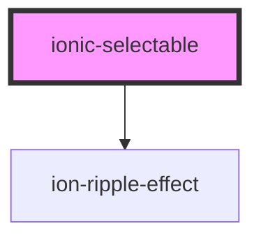

# ionic-selectable

<!-- Auto Generated Below -->

## Properties

| Property                 | Attribute                   | Description                                                                                                                                                                                                                                                                                                              | Type                                     | Default     |
| ------------------------ | --------------------------- | ------------------------------------------------------------------------------------------------------------------------------------------------------------------------------------------------------------------------------------------------------------------------------------------------------------------------ | ---------------------------------------- | ----------- |
| `canAddItem`             | `can-add-item`              | Determines whether to allow adding items. See more on [GitHub](https://github.com/eakoriakin/ionic-selectable/wiki/Documentation#canadditem).                                                                                                                                                                            | `boolean`                                | `false`     |
| `canClear`               | `can-clear`                 | Determines whether to show Clear button. See more on [GitHub](https://github.com/eakoriakin/ionic-selectable/wiki/Documentation#canclear).                                                                                                                                                                               | `boolean`                                | `false`     |
| `closeButtonText`        | `close-button-text`         | Close button text. The field is only applicable to **iOS** platform, on **Android** only Cross icon is displayed. See more on [GitHub](https://github.com/eakoriakin/ionic-selectable/wiki/Documentation#closebuttontext).                                                                                               | `string`                                 | `'Cancel'`  |
| `confirmButtonText`      | `confirm-button-text`       | Confirm button text. See more on [GitHub](https://github.com/eakoriakin/ionic-selectable/wiki/Documentation#confirmbuttontext).                                                                                                                                                                                          | `string`                                 | `'OK'`      |
| `groupTextField`         | `group-text-field`          | Group property to display, e.g. `'country.name'`. **Note**: `items` should be an object array. See more on [GitHub](https://github.com/eakoriakin/ionic-selectable/wiki/Documentation#grouptextfield).                                                                                                                   | `string`                                 | `null`      |
| `groupValueField`        | `group-value-field`         | Group property to use as a unique identifier to group items, e.g. `'country.id'`. **Note**: `items` should be an object array. See more on [GitHub](https://github.com/eakoriakin/ionic-selectable/wiki/Documentation#groupvaluefield).                                                                                  | `string`                                 | `null`      |
| `hasConfirmButton`       | `has-confirm-button`        | Determines whether Confirm button is visible for single selection. By default Confirm button is visible only for multiple selection. **Note**: It is always true for multiple selection and cannot be changed. See more on [GitHub](https://github.com/eakoriakin/ionic-selectable/wiki/Documentation#hasconfirmbutton). | `boolean`                                | `false`     |
| `hasInfiniteScroll`      | `has-infinite-scroll`       | Determines whether Ionic [InfiniteScroll](https://ionicframework.com/docs/api/components/infinite-scroll/InfiniteScroll/) is enabled. **Note**: Infinite scroll cannot be used together with virtual scroll. See more on [GitHub](https://github.com/eakoriakin/ionic-selectable/wiki/Documentation#hasinfinitescroll).  | `boolean`                                | `false`     |
| `hasVirtualScroll`       | `has-virtual-scroll`        | Determines whether Ionic [VirtualScroll](https://ionicframework.com/docs/api/components/virtual-scroll/VirtualScroll/) is enabled. **Note**: Virtual scroll cannot be used together with infinite scroll. See more on [GitHub](https://github.com/eakoriakin/ionic-selectable/wiki/Documentation#hasvirtualscroll).      | `boolean`                                | `false`     |
| `isConfirmButtonEnabled` | `is-confirm-button-enabled` | Determines whether Confirm button is enabled. See more on [GitHub](https://github.com/eakoriakin/ionic-selectable/wiki/Documentation#isconfirmbuttonenabled).                                                                                                                                                            | `boolean`                                | `true`      |
| `isDisabled`             | `is-disabled`               | Determines whether the component is disabled. See more on [GitHub](https://github.com/eakoriakin/ionic-selectable/wiki/Documentation#isdisabled).                                                                                                                                                                        | `boolean`                                | `false`     |
| `isMultiple`             | `is-multiple`               | Determines whether multiple items can be selected. See more on [GitHub](https://github.com/eakoriakin/ionic-selectable/wiki/Documentation#ismultiple).                                                                                                                                                                   | `boolean`                                | `false`     |
| `isOpened`               | `is-opened`                 | Determines whether Modal is opened. See more on [GitHub](https://github.com/eakoriakin/ionic-selectable/wiki/Documentation#isopened).                                                                                                                                                                                    | `boolean`                                | `false`     |
| `itemTextField`          | `item-text-field`           | Item property to display, e.g, `'name'`. **Note**: `items` should be an object array. See more on [GitHub](https://github.com/eakoriakin/ionic-selectable/wiki/Documentation#itemtextfield).                                                                                                                             | `string`                                 | `null`      |
| `itemValueField`         | `item-value-field`          | Item property to use as a unique identifier, e.g, `'id'`. **Note**: `items` should be an object array. See more on [GitHub](https://github.com/eakoriakin/ionic-selectable/wiki/Documentation#itemvaluefield).                                                                                                           | `string`                                 | `null`      |
| `items`                  | --                          | A list of items. See more on [GitHub](https://github.com/eakoriakin/ionic-selectable/wiki/Documentation#items).                                                                                                                                                                                                          | `any[]`                                  | `[]`        |
| `modalCssClass`          | `modal-css-class`           | Modal CSS class. See more on [GitHub](https://github.com/eakoriakin/ionic-selectable/wiki/Documentation#modalcssclass).                                                                                                                                                                                                  | `string`                                 | `null`      |
| `modalEnterAnimation`    | --                          | Modal enter animation. See more on [GitHub](https://github.com/eakoriakin/ionic-selectable/wiki/Documentation#modalenteranimation).                                                                                                                                                                                      | `(baseEl: any, opts?: any) => Animation` | `null`      |
| `modalLeaveAnimation`    | --                          | Modal leave animation. See more on [GitHub](https://github.com/eakoriakin/ionic-selectable/wiki/Documentation#modalleaveanimation).                                                                                                                                                                                      | `(baseEl: any, opts?: any) => Animation` | `null`      |
| `mode`                   | `mode`                      | The mode determines which platform styles to use.                                                                                                                                                                                                                                                                        | `"ios" \| "md"`                          | `undefined` |
| `name`                   | `name`                      | The name of the control, which is submitted with the form data. See more on [GitHub](https://github.com/eakoriakin/ionic-selectable/wiki/Documentation#name).                                                                                                                                                            | `string`                                 | `this.id`   |
| `placeholder`            | `placeholder`               | A placeholder. See more on [GitHub](https://github.com/eakoriakin/ionic-selectable/wiki/Documentation#placeholder).                                                                                                                                                                                                      | `string`                                 | `undefined` |
| `selectedText`           | `selected-text`             | Determines whether multiple items can be selected. See more on [GitHub](https://github.com/eakoriakin/ionic-selectable/wiki/Documentation#selectedText).                                                                                                                                                                 | `string`                                 | `undefined` |
| `shouldBackdropClose`    | `should-backdrop-close`     | Determines whether Modal should be closed when backdrop is clicked. See more on [GitHub](https://github.com/eakoriakin/ionic-selectable/wiki/Documentation#shouldbackdropclose).                                                                                                                                         | `boolean`                                | `undefined` |
| `shouldStoreItemValue`   | `should-store-item-value`   | Is set to true, the value will be extracted from the itemValueField of the objects. See more on [GitHub](https://github.com/eakoriakin/ionic-selectable/wiki/Documentation#shouldStoreItemValue).                                                                                                                        | `boolean`                                | `false`     |
| `titleText`              | `title-text`                | Text of [Ionic Label](https://ionicframework.com/docs/api/label). See more on [GitHub](https://github.com/eakoriakin/ionic-selectable/wiki/Documentation#label).                                                                                                                                                         | `string`                                 | `null`      |
| `value`                  | `value`                     | The value of the component. See more on [GitHub](https://github.com/eakoriakin/ionic-selectable/wiki/Documentation#value).                                                                                                                                                                                               | `any`                                    | `null`      |

## Events

| Event      | Description                                                                                                                                                                                                                | Type                                 |
| ---------- | -------------------------------------------------------------------------------------------------------------------------------------------------------------------------------------------------------------------------- | ------------------------------------ |
| `blurred`  | Fires when loses focus. See more on [GitHub](https://github.com/eakoriakin/ionic-selectable/wiki/Documentation#onBlurred).                                                                                                 | `CustomEvent<IIonicSelectableEvent>` |
| `changed`  | Fires when item/s has been selected and Modal closed. if isMultiple is set to true 'value' is an array else is a object See more on [GitHub](https://github.com/eakoriakin/ionic-selectable/wiki/Documentation#onChanged). | `CustomEvent<IIonicSelectableEvent>` |
| `closed`   | Fires when Modal has been closed. See more on [GitHub](https://github.com/eakoriakin/ionic-selectable/wiki/Documentation#onclose).                                                                                         | `CustomEvent<IIonicSelectableEvent>` |
| `focused`  | Fires when has focus See more on [GitHub](https://github.com/eakoriakin/ionic-selectable/wiki/Documentation#onFocused).                                                                                                    | `CustomEvent<IIonicSelectableEvent>` |
| `opened`   | Fires when Modal has been opened. See more on [GitHub](https://github.com/eakoriakin/ionic-selectable/wiki/Documentation#onopen).                                                                                          | `CustomEvent<IIonicSelectableEvent>` |
| `selected` | Fires when an item has been selected or unselected. See more on [GitHub](https://github.com/eakoriakin/ionic-selectable/wiki/Documentation#onselect).                                                                      | `CustomEvent<IIonicSelectableEvent>` |

## Methods

### `close() => Promise<void>`

Closes Modal.
See more on [GitHub](https://github.com/eakoriakin/ionic-selectable/wiki/Documentation#close).

#### Returns

Type: `Promise<void>`

### `confirm() => Promise<void>`

Confirms selected items by updating value.
See more on [GitHub](https://github.com/eakoriakin/ionic-selectable/wiki/Documentation#confirm).

#### Returns

Type: `Promise<void>`

### `getItemsToConfirm() => Promise<any[]>`

Return a list of items that are selected and awaiting confirmation by user, when he has clicked Confirm button.
After the user has clicked Confirm button items to confirm are cleared.
See more on [GitHub](https://github.com/eakoriakin/ionic-selectable/wiki/Documentation#itemstoconfirm).

#### Returns

Type: `Promise<any[]>`

### `hasValue() => Promise<boolean>`

Determines whether any item has been selected.
See more on [GitHub](https://github.com/eakoriakin/ionic-selectable/wiki/Documentation#hasvalue).

#### Returns

Type: `Promise<boolean>`

### `open() => Promise<void>`

Opens Modal.
See more on [GitHub](https://github.com/eakoriakin/ionic-selectable/wiki/Documentation#open).

#### Returns

Type: `Promise<void>`

## CSS Custom Properties

| Name                    | Description                                                                                 |
| ----------------------- | ------------------------------------------------------------------------------------------- |
| `--padding-bottom`      | Bottom padding                                                                              |
| `--padding-end`         | Right padding if direction is left-to-right, and left padding if direction is right-to-left |
| `--padding-start`       | Left padding if direction is left-to-right, and right padding if direction is right-to-left |
| `--padding-top`         | Top padding                                                                                 |
| `--placeholder-color`   | Placeholder color                                                                           |
| `--placeholder-opacity` | Placeholder opacity                                                                         |

## Dependencies

### Depends on

- ion-ripple-effect

### Graph

----------------------------------------------

*Built with [StencilJS](https://stenciljs.com/)*
